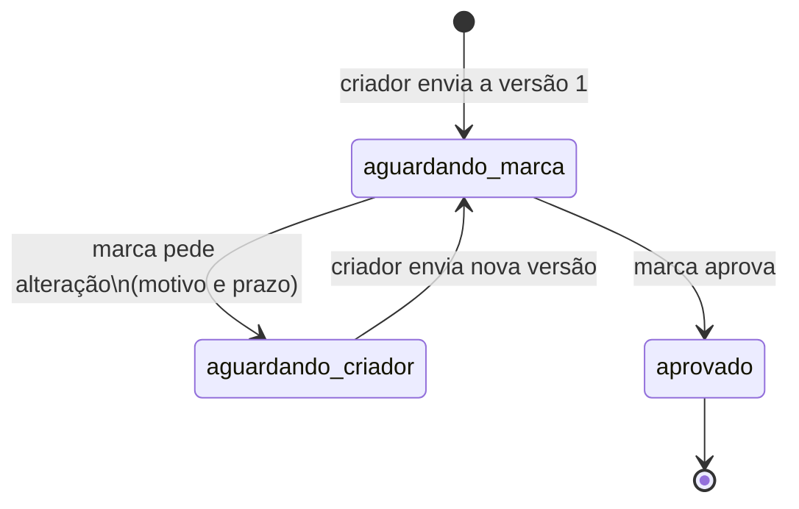

# Revisão de roteiro

Antes do vídeo, marca e criador revisam o roteiro por versões. Cada roteiro tem um estado explícito. A resposta diz quem age agora e qual chamada fazer em seguida.

Para ler o código: este arquivo, depois [`src/dominio/roteiro.ts`](src/dominio/roteiro.ts) (a máquina de estados) e [`test/http.test.ts`](test/http.test.ts) (o fluxo inteiro).

## Como rodar

Requer Node.js 22 ou mais novo.

```bash
npm install
npm test
npm start
```

A API sobe em `http://localhost:3000`. `PORT` troca a porta. Os dados ficam em memória e somem quando o processo encerra. `npm run typecheck` só confere os tipos.

## Fluxo e estados

O estado do **roteiro** diz quem age. O estado da **versão** diz o que aconteceu com aquele texto. Versão enviada não se edita: correção é outra versão.



| Estado do roteiro | Quem age | O que pode acontecer |
| --- | --- | --- |
| `aguardando_marca` | marca | pedir alteração ou aprovar |
| `aguardando_criador` | criador | enviar outra versão |
| `aprovado` | ninguém | a revisão encerrou; o histórico continua legível |

| Estado da versão | Significado |
| --- | --- |
| `em_analise` | versão atual, esperando a marca |
| `alteracao_pedida` | a marca pediu mudança nesta versão; motivo e prazo ficam nela |
| `aprovada` | a marca aprovou esta versão |

Pedido sem motivo, sem prazo, com prazo inválido ou com prazo que já passou responde **400** e não muda nada. Transição fora do estado responde **409** e devolve `status` e `proximaAcao`. Roteiro inexistente responde **404**.

`proximaAcao.opcoes` traz método, caminho e campos do corpo. Dá para seguir o fluxo por aí, sem tabela paralela.

## Exemplos

Os JSON abaixo estão resumidos. A API devolve o roteiro inteiro: `versoes` (histórico, da mais antiga à mais nova), `versaoAtual` e `proximaAcao`. Corpo inválido responde 400 mesmo quando a transição também seria inválida.

Abrir a revisão (versão 1):

```bash
curl -s -X POST http://localhost:3000/roteiros \
  -H 'content-type: application/json' \
  -d '{"campanhaId":"cmp_outubro","conteudo":"Versão 1: produto na mesa, sem cupom."}'
```

```json
{
  "id": "rot_…",
  "campanhaId": "cmp_outubro",
  "status": "aguardando_marca",
  "versoes": [
    {
      "id": "ver_…",
      "numero": 1,
      "conteudo": "Versão 1: produto na mesa, sem cupom.",
      "status": "em_analise",
      "criadaEm": "2026-10-07T12:00:00.000Z"
    }
  ],
  "versaoAtual": { "numero": 1, "status": "em_analise" },
  "proximaAcao": {
    "ator": "marca",
    "descricao": "A marca analisa a versão atual. Pode pedir alteração, com motivo e prazo, ou aprovar e encerrar a revisão.",
    "opcoes": [
      {
        "acao": "pedir_alteracao",
        "metodo": "POST",
        "caminho": "/roteiros/rot_…/pedidos-alteracao",
        "corpo": ["motivo", "prazo"]
      },
      { "acao": "aprovar", "metodo": "POST", "caminho": "/roteiros/rot_…/aprovacao" }
    ]
  }
}
```

Pedir alteração. O prazo é um instante futuro no relógio do servidor. Data sem hora (`2026-12-01`) vale até `23:59:59.999Z` desse dia. Se o exemplo abaixo falhar porque a data já passou, troque o prazo.

```bash
curl -s -X POST http://localhost:3000/roteiros/rot_…/pedidos-alteracao \
  -H 'content-type: application/json' \
  -d '{"motivo":"Citar o cupom de outubro no CTA.","prazo":"2026-12-01T18:00:00.000Z"}'
```

```json
{
  "status": "aguardando_criador",
  "versaoAtual": {
    "numero": 1,
    "status": "alteracao_pedida",
    "pedidoAlteracao": {
      "motivo": "Citar o cupom de outubro no CTA.",
      "prazo": "2026-12-01T18:00:00.000Z",
      "solicitadoEm": "2026-10-07T12:00:00.000Z"
    }
  },
  "proximaAcao": {
    "ator": "criador",
    "opcoes": [
      {
        "acao": "enviar_versao",
        "metodo": "POST",
        "caminho": "/roteiros/rot_…/versoes",
        "corpo": ["conteudo"]
      }
    ]
  }
}
```

Sem motivo, a revisão não anda:

```bash
curl -s -X POST http://localhost:3000/roteiros/rot_…/pedidos-alteracao \
  -H 'content-type: application/json' \
  -d '{"prazo":"2026-12-01T18:00:00.000Z"}'
```

```json
{
  "erro": "validacao",
  "mensagem": "Pedido de alteração exige motivo e um prazo futuro.",
  "campos": { "motivo": "Informe o que precisa mudar." }
}
```

Sem prazo, o mesmo 400, com `campos.prazo`. O criador então manda outra versão. A primeira continua no array `versoes`, com o pedido.

```bash
curl -s -X POST http://localhost:3000/roteiros/rot_…/versoes \
  -H 'content-type: application/json' \
  -d '{"conteudo":"Versão 2: CTA com o cupom OUTUBRO."}'
```

```json
{
  "status": "aguardando_marca",
  "versoes": [
    { "numero": 1, "status": "alteracao_pedida", "conteudo": "Versão 1: produto na mesa, sem cupom." },
    { "numero": 2, "status": "em_analise", "conteudo": "Versão 2: CTA com o cupom OUTUBRO." }
  ],
  "versaoAtual": { "numero": 2, "status": "em_analise" }
}
```

Aprovar encerra. Depois disso, pedido, versão nova e nova aprovação respondem 409.

```bash
curl -s -X POST http://localhost:3000/roteiros/rot_…/aprovacao
```

```json
{
  "status": "aprovado",
  "versaoAtual": { "numero": 2, "status": "aprovada" },
  "proximaAcao": {
    "ator": null,
    "descricao": "A revisão está encerrada. A versão aprovada e as anteriores continuam disponíveis para consulta.",
    "opcoes": []
  }
}
```

Consulta do histórico: `GET /roteiros/rot_…`. Criar roteiro e criar versão respondem **201**. Pedido de alteração e aprovação respondem **200**.

## Decisões que eu mudaria com mais tempo

- Hoje o `RepositorioRoteiro` guarda tudo em memória. Com mais tempo a mesma interface passaria a usar SQLite num arquivo, para o histórico sobreviver ao restart, ainda sem subir um Postgres.
- Marca e criador são papéis descritos em `proximaAcao`, não identidades. Com mais tempo cada rota exigiria o token do ator correspondente.
- O prazo é UTC. Com mais tempo eu usaria o fuso da marca e um aviso quando o prazo vencesse.
- `campanhaId` é um rótulo: a mesma campanha pode ter duas revisões abertas. Com mais tempo haveria no máximo uma revisão aberta por campanha.
- Dois pedidos simultâneos podem se sobrepor, porque não há versão de concorrência. Com mais tempo um `revisao` numérico faria o segundo update voltar 409.
- A marca não cancela um pedido se mudar de ideia. O criador envia outra versão e a marca aprova essa. Com mais tempo existiria `cancelar_pedido`, de `aguardando_criador` de volta para `aguardando_marca`, sem versão nova.

## O que ficou de fora

- Vídeo, upload e qualquer tela. A API é a entrega.
- Chat solto. O que a marca pediu fica no `pedidoAlteracao` da versão.
- Login, notificações e edição do texto de uma versão já enviada.

## Uso de IA

O código deste repositório foi gerado por um agente de IA (Cursor). A máquina de estados, as rotas e os testes saíram desse agente.

Revisado por Nicolas: [preencher]
